# Dynamical Systems in Neuroscience
[*The Geometry of Excitability and Bursting*](https://www.izhikevich.org/publications/dsn.pdf)

## Figure 8.12
[Pluto Notebook](https://github.com/ianwineman/dynamical-systems-neuro/blob/main/notebooks/fig8_12.jl)

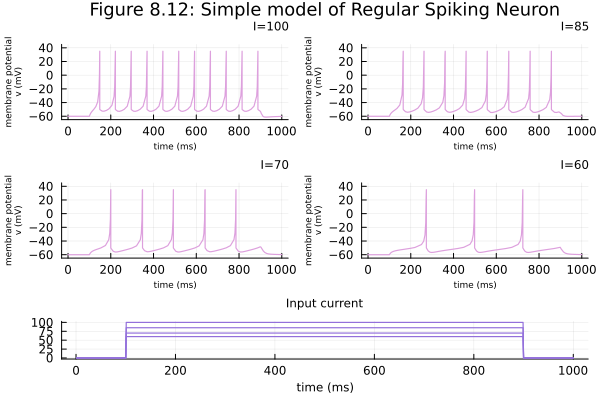

## Figure 8.6a with callback
[Pluto Notebook](https://github.com/ianwineman/dynamical-systems-neuro/blob/main/notebooks/fig8_6a_callback.jl)

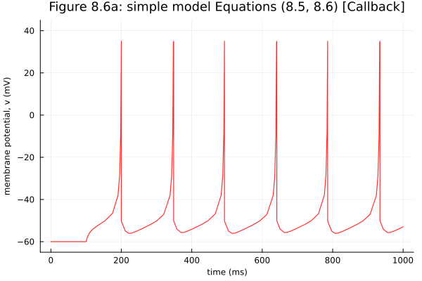

## Figure 8.6a
[Pluto Notebook](https://github.com/ianwineman/dynamical-systems-neuro/blob/main/notebooks/fig8_6a.jl)

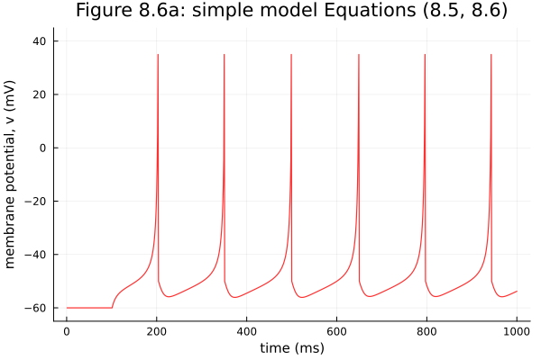

## Figure 6.5
[Pluto Notebook](https://github.com/ianwineman/dynamical-systems-neuro/blob/main/notebooks/fig6_5.jl)

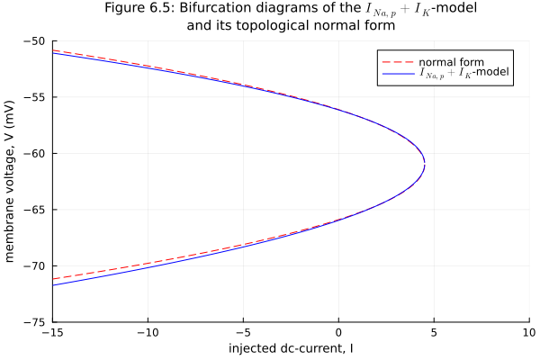

## Exercise 5.3b
[Pluto Notebook](https://github.com/ianwineman/dynamical-systems-neuro/blob/main/notebooks/exercise5_3b.jl)

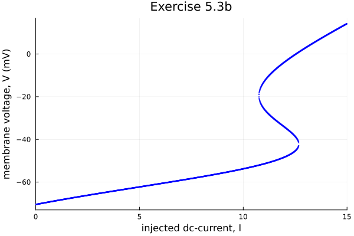

## Figure 5.20
[Pluto Notebook](https://github.com/ianwineman/dynamical-systems-neuro/blob/main/notebooks/fig5_20.jl)

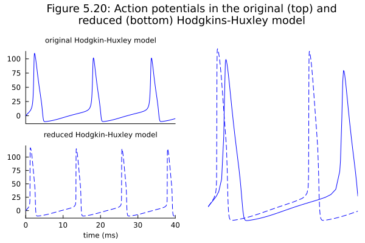

## Figure 5.18
[Pluto Notebook](https://github.com/ianwineman/dynamical-systems-neuro/blob/main/notebooks/fig5_18.jl)

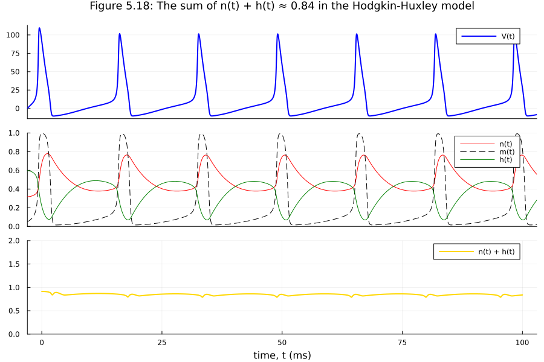

## Figure 5.8
[Pluto Notebook](https://github.com/ianwineman/dynamical-systems-neuro/blob/main/notebooks/fig5_8.jl)

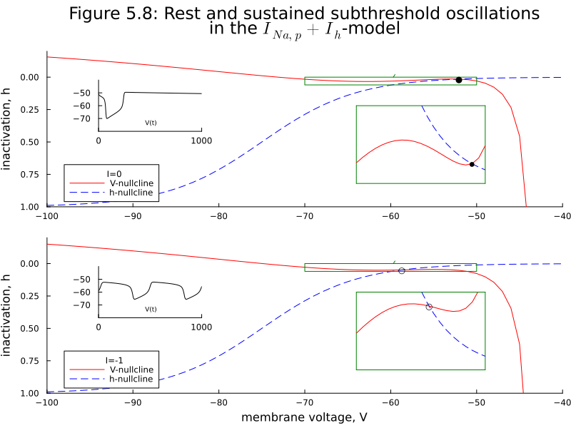

## Figure 4.35b
[Pluto Notebook](https://github.com/ianwineman/dynamical-systems-neuro/blob/main/notebooks/fig4_35b.jl)

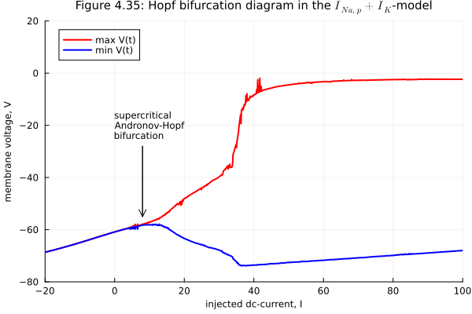

## Figure 4.33
[Pluto Notebook](https://github.com/ianwineman/dynamical-systems-neuro/blob/main/notebooks/fig4_33.jl)

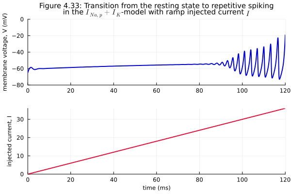

## Figure 4.4
[Pluto Notebook](https://github.com/ianwineman/dynamical-systems-neuro/blob/main/notebooks/fig4_4.jl)

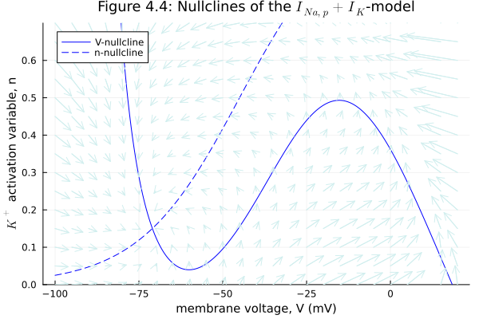

## Exercise 3.16
[Pluto Notebook](https://github.com/ianwineman/dynamical-systems-neuro/blob/main/notebooks/exercise3_16.jl) for interactive 3D figure.

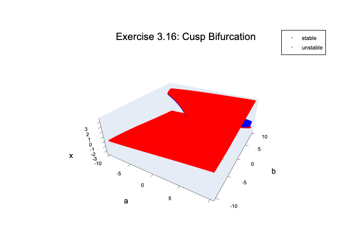
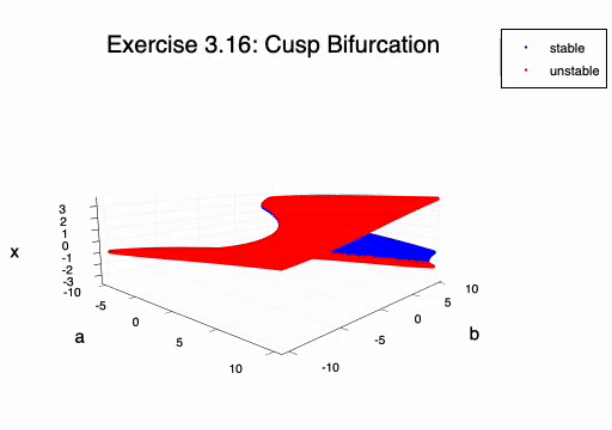

## Exercise 3.12
[Pluto Notebook](https://github.com/ianwineman/dynamical-systems-neuro/blob/main/notebooks/exercise3_12.jl)

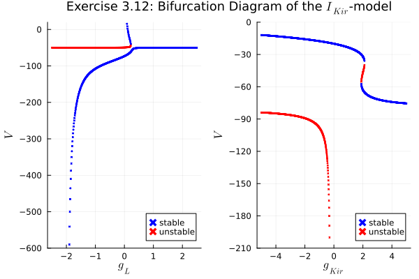

## Exercise 3.11
[Pluto Notebook](https://github.com/ianwineman/dynamical-systems-neuro/blob/main/notebooks/exercise3_11.jl)

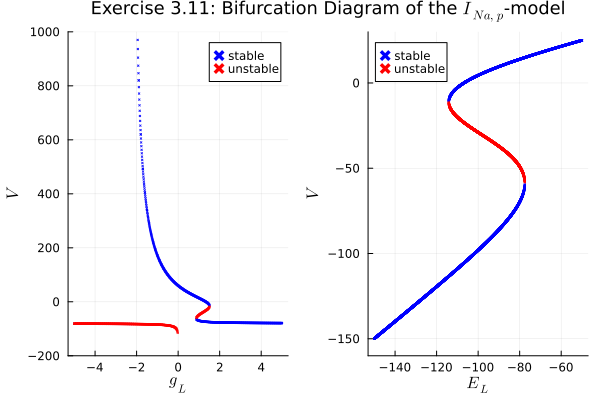

## Exercise 3.9
[Pluto Notebook](https://github.com/ianwineman/dynamical-systems-neuro/blob/main/notebooks/exercise3_9.jl)

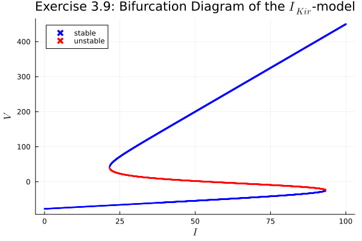

## Figure 3.33
[Pluto Notebook](https://github.com/ianwineman/dynamical-systems-neuro/blob/main/notebooks/fig3_33.jl)

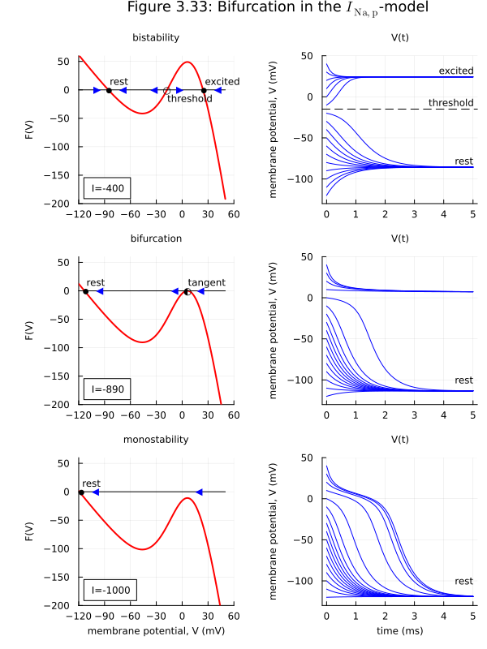

## Figure 3.32
[Pluto Notebook](https://github.com/ianwineman/dynamical-systems-neuro/blob/main/notebooks/fig3_32.jl)

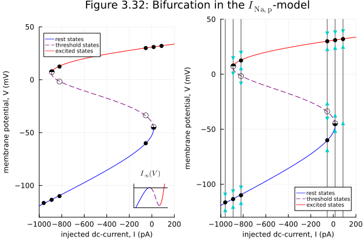

## Figure 3.31
[Pluto Notebook](https://github.com/ianwineman/dynamical-systems-neuro/blob/main/notebooks/fig3_31.jl)

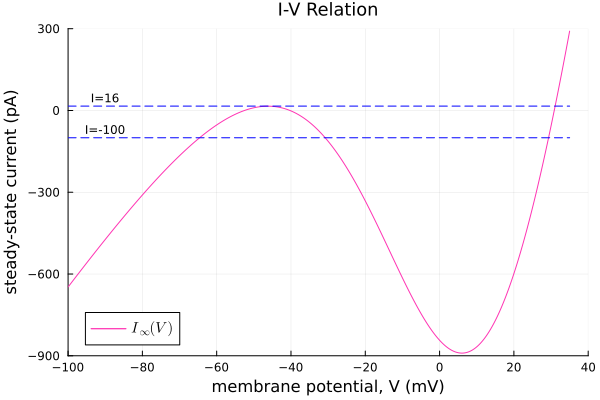

## Figure 3.30
[Pluto Notebook](https://github.com/ianwineman/dynamical-systems-neuro/blob/main/notebooks/fig3_30.jl)

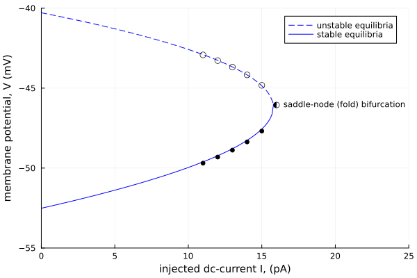

## Figure 3.25
[Pluto Notebook](https://github.com/ianwineman/dynamical-systems-neuro/blob/main/notebooks/fig3_25.jl)

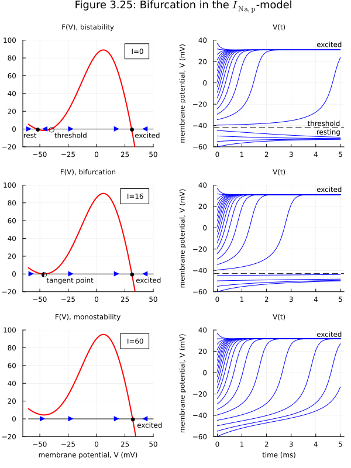

## Figure 3.6
[Pluto Notebook](https://github.com/ianwineman/dynamical-systems-neuro/blob/main/notebooks/fig3_6.jl)

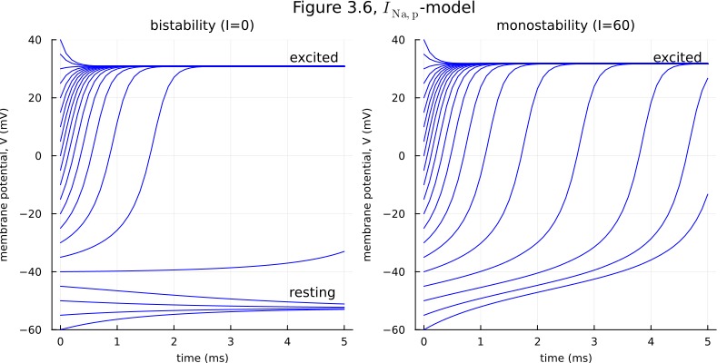

## Hodgkin-Huxley Model
[Pluto Notebook](https://github.com/ianwineman/dynamical-systems-neuro/blob/main/notebooks/hodgkin-huxley.jl)

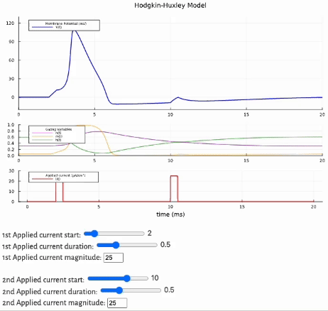

## Figure 2.15
[Pluto Notebook](https://github.com/ianwineman/dynamical-systems-neuro/blob/main/notebooks/fig2_15.jl)

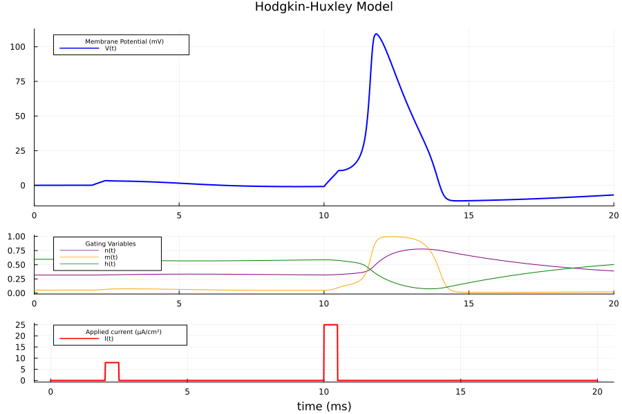

## Figure 2.13
[Pluto Notebook](https://github.com/ianwineman/dynamical-systems-neuro/blob/main/notebooks/fig2_13.jl)

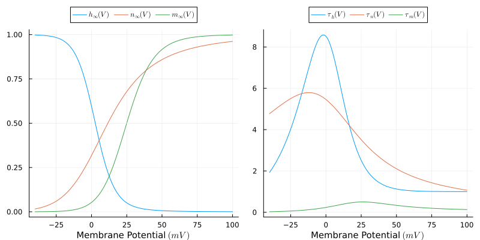
