# Dynamical Systems in Neuroscience
[*The Geometry of Excitability and Bursting*](https://www.izhikevich.org/publications/dsn.pdf)

## Exercise 3.16
See [Pluto Notebook](https://github.com/ianwineman/dynamical-systems-neuro/blob/main/exercise3_16.jl) for interactive 3D figure.

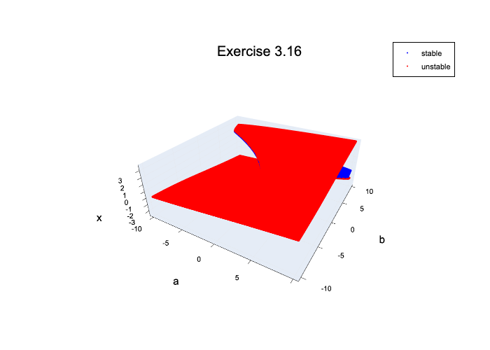
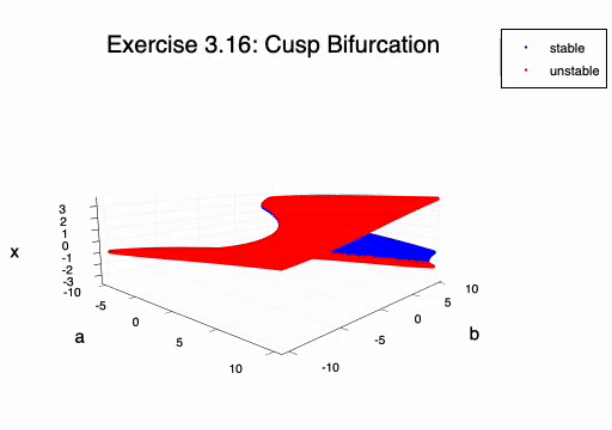

## Exercise 3.12
[Pluto Notebook](https://github.com/ianwineman/dynamical-systems-neuro/blob/main/exercise3_12.jl)

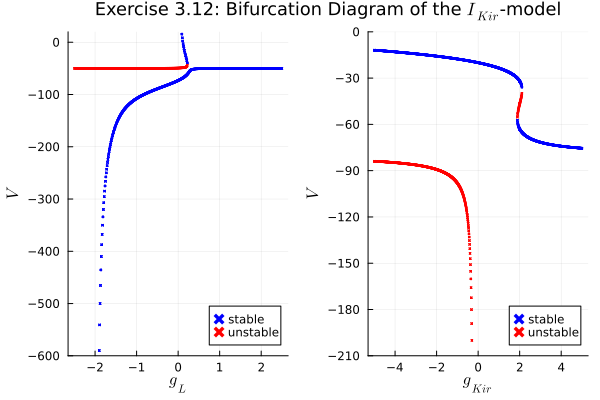

## Exercise 3.11
[Pluto Notebook](https://github.com/ianwineman/dynamical-systems-neuro/blob/main/exercise3_11.jl)

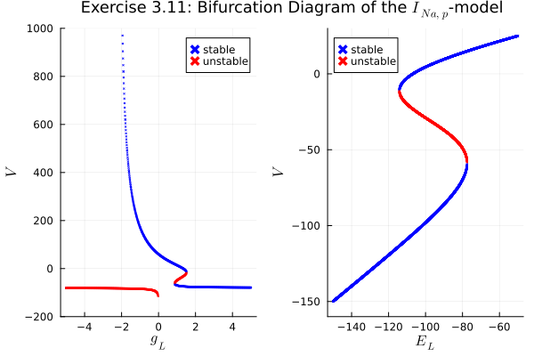

## Exercise 3.9
[Pluto Notebook](https://github.com/ianwineman/dynamical-systems-neuro/blob/main/exercise3_9.jl)

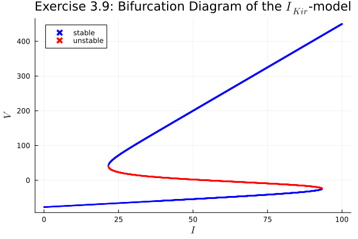

## Figure 3.33
[Pluto Notebook](https://github.com/ianwineman/dynamical-systems-neuro/blob/main/fig3_33.jl)

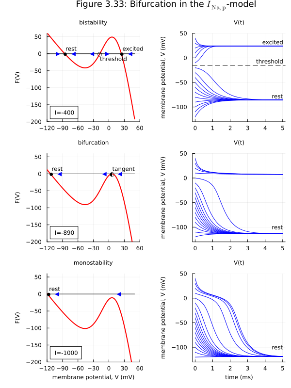

## Figure 3.32
[Pluto Notebook](https://github.com/ianwineman/dynamical-systems-neuro/blob/main/fig3_32.jl)

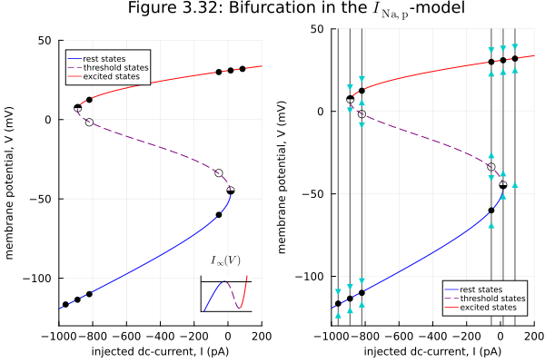

## Figure 3.31
[Pluto Notebook](https://github.com/ianwineman/dynamical-systems-neuro/blob/main/fig3_31.jl)

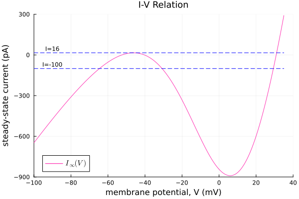

## Figure 3.30
[Pluto Notebook](https://github.com/ianwineman/dynamical-systems-neuro/blob/main/fig3_30.jl)

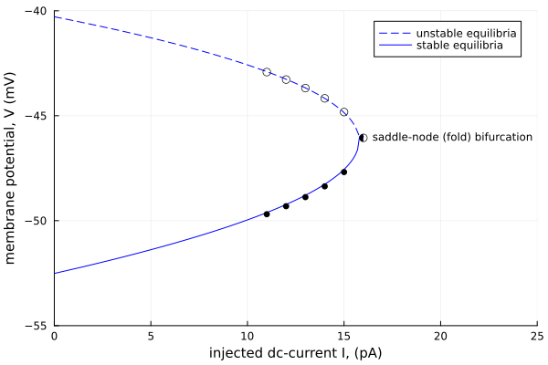

## Figure 3.25
[Pluto Notebook](https://github.com/ianwineman/dynamical-systems-neuro/blob/main/fig3_25.jl)

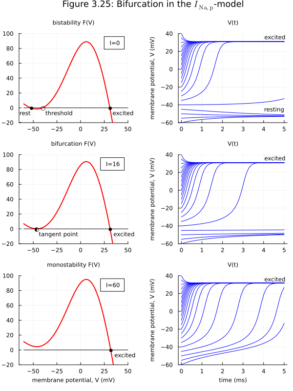

## Figure 3.6
[Pluto Notebook](https://github.com/ianwineman/dynamical-systems-neuro/blob/main/fig3_6.jl)

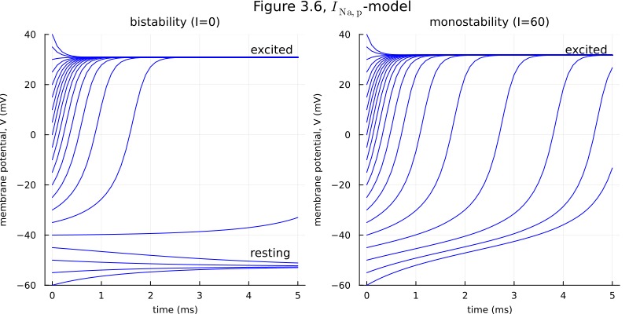

## Hodgkin-Huxley Model
[Pluto Notebook](https://github.com/ianwineman/dynamical-systems-neuro/blob/main/hodgkin-huxley.jl)

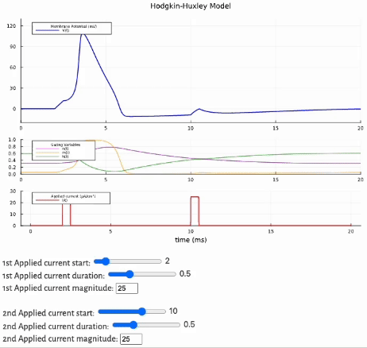

## Figure 2.15
[Pluto Notebook](https://github.com/ianwineman/dynamical-systems-neuro/blob/main/fig2_15.jl)

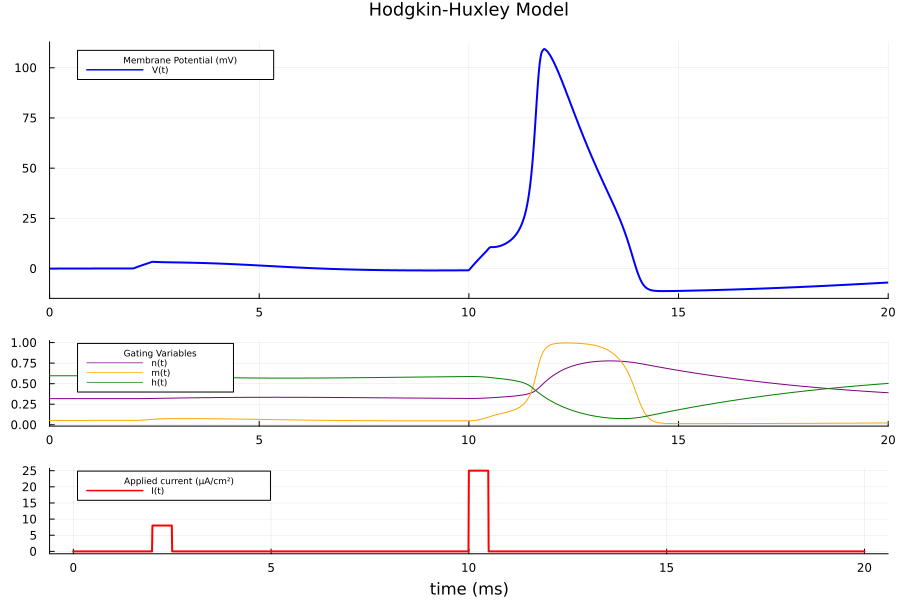

## Figure 2.13
[Pluto Notebook](https://github.com/ianwineman/dynamical-systems-neuro/blob/main/fig2_13.jl)

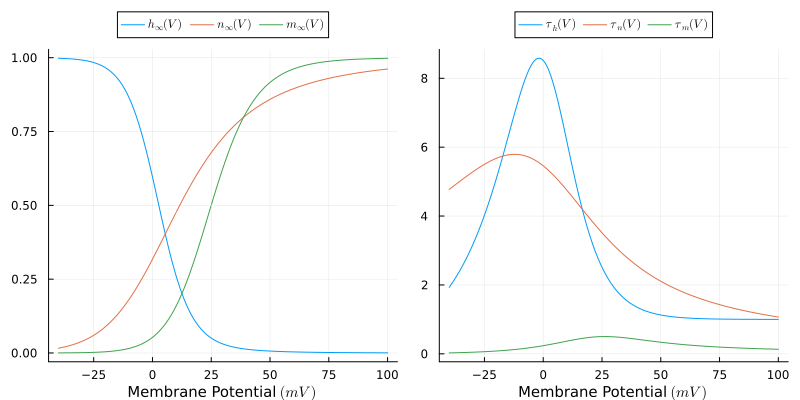
